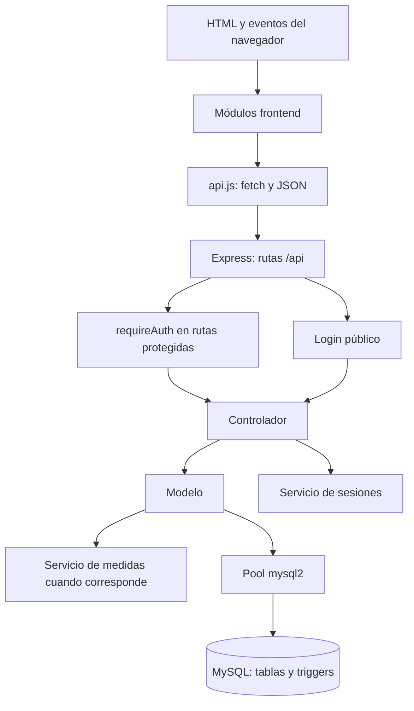

# Districarnes: arquitectura y explicación archivo por archivo

Manual de estudio basado en el código revisado el 6 de septiembre de 2026. Describe la versión actual: las propuestas de mejora están marcadas como tales. No se modificó la aplicación para escribirlo. Léelo con los archivos abiertos; las funciones son referencias más estables que los números de línea.

## 1. Ejemplos reales: qué enseñan y qué aplicar aquí

| Ejemplo consultado | Organización observada | Comparación con Districarnes |
|---|---|---|
| [Generador oficial de Express](https://expressjs.com/en/starter/generator/) | app.js, bin/www, routes, public y views | Tu server.js cumple el papel de arranque; FRONTEND reúne HTML y recursos que el ejemplo separa entre vistas y archivos públicos. |
| [RealWorld: Node, Express y Prisma](https://github.com/gothinkster/node-express-realworld-example-app) | src, e2e y configuración de pruebas; su README separa migraciones y carga de datos iniciales | Conviene separar instalación, actualización de esquema, datos de demostración y pruebas. No es necesario incorporar Prisma para lograrlo. |

Express explica que el árbol generado admite modificaciones según la aplicación. Por eso, la ausencia de una carpeta llamada controllers en un ejemplo no elimina el concepto de controlador, y la presencia de esa carpeta tampoco demuestra que el código respete sus responsabilidades.

Estos son ejemplos técnicos de sus autores, no proyectos certificados por el SENA. La [oferta oficial de ADSO](https://betowa.sena.edu.co/oferta/analisis-y-desarrollo-de-software) incluye diseño, desarrollo, requisitos y calidad, pero esa página no prescribe nombres de carpetas. No tenemos la rúbrica del instructor y no atribuimos a estos ejemplos un carácter obligatorio.

El schema puede acompañar al código. Lo que importa es distinguir el archivo que define la base de los datos que MySQL administra. Una organización académica clara para este proyecto sería FRONTEND, BACKEND, database, docs y scripts. Mover el SQL a database en la raíz no exige cambiar la conexión: Node no lee ese archivo durante el arranque.

## 2. Qué arquitectura tiene tu aplicación

Hay tres lugares de ejecución: navegador, proceso Node.js y servidor MySQL. Pueden estar en un mismo computador y seguir siendo componentes distintos. Abrir Workbench no equivale a iniciar MySQL; Workbench es un cliente de administración.

| Concepto | En este proyecto | Qué significa |
|---|---|---|
| Cliente-servidor | Navegador → API Express | La pantalla solicita operaciones a un proceso que valida y accede a los datos. |
| Presentación | FRONTEND | HTML, apariencia, eventos y estado temporal del carrito. |
| Aplicación y reglas | Controladores, servicios, parte de los modelos | Decide si una solicitud es válida y coordina operaciones. |
| Persistencia | Modelos SQL + MySQL | Guarda y recupera información duradera. |
| MVC como organización | Vistas en FRONTEND; controladores y modelos en BACKEND | Ayuda a separar responsabilidades, aunque no es un MVC con plantillas renderizadas en servidor. |
| Backend monolítico modular | Una aplicación Express con varios módulos | Todo el backend arranca junto; no hay servicios independientes desplegados por módulo. |

La separación por capas no es estricta: saleModel también calcula y coordina ventas; MySQL aplica reglas mediante triggers; el frontend hace cálculos preliminares. Debes describir esa realidad, no afirmar que todas las reglas están en services.



El diagrama muestra llamadas principales, no que todas las peticiones recorran todos los servicios. Las respuestas regresan hacia la pantalla en JSON. Los scripts frontend no importan los controladores: se comunican por HTTP. Los controladores tampoco seleccionan elementos HTML.

### Estado: dónde vive cada cosa

| Información | Lugar | Cuándo se pierde o persiste |
|---|---|---|
| Productos, ventas, cuentas | MySQL | Persisten al cerrar navegador o reiniciar Node. |
| Token reconocido y datos de sesión | Map de sessionService en Node | Se pierden al reiniciar ese proceso. |
| Copia del token del navegador | sessionStorage | Permanece durante la sesión de esa pestaña, incluso tras una recarga. |
| Carrito, página y catálogo cargado | Variables de sales.js | Se pierden al recargar el documento. |
| Categoría/fecha elegidas | Controles HTML y variables | Se conservan al cambiar secciones del mismo documento; no necesariamente al recargar. |

Un token presente en sessionStorage no prueba que MySQL esté disponible ni que el servidor conserve la sesión. Por eso existen hasSession en navegador y requireAuth en servidor: hacen comprobaciones diferentes.

## 3. Cómo leer las instrucciones repetidas

| Construcción | Significado aplicado |
|---|---|
| require('../models/productModel') | Importa un módulo de Node. .. sube una carpeta. |
| module.exports = { list, create } | Expone funciones para otros archivos del backend. |
| import/export | Sistema de módulos utilizado por el navegador; requiere script type=module. |
| const / let | Referencia que no se reasigna / variable que sí se reasigna. Un arreglo const aún puede cambiar por push. |
| async / await | Espera una promesa, por ejemplo una consulta, sin convertir todo el servidor en una operación síncrona. |
| try/catch/finally | Ejecuta; maneja errores; ejecuta limpieza tanto en éxito como en fallo. |
| req.body | JSON del cuerpo, interpretado por express.json. |
| req.params.id | Parte variable de /productos/:id. |
| req.query.fecha | Parámetro en ?fecha=2026-09-06. |
| res.status(201).json(...) | Selecciona código HTTP y envía respuesta JSON. |
| next(error) | Entrega el error al manejador de errores de Express. |
| ?. | Acceso opcional ante null/undefined; no verifica que un valor sea del tipo correcto. |
| ?? | Valor alternativo solo ante null/undefined; conserva false y 0. |
| \|\| | Alternativa ante cualquier valor falso, incluidos 0 y cadena vacía. |
| map / filter / find / reduce | Transformar lista / seleccionar elementos / encontrar uno / acumular un resultado. |
| ...objeto | Copia superficial de propiedades; no consulta la base ni clona profundamente. |
| Number(value) | Convierte a número; no es por sí mismo una validación completa. |
| event.preventDefault() | Evita el envío y recarga tradicional del formulario. |
| dataset.edit | Lee data-edit del elemento HTML. |
| innerHTML / textContent | Interpreta una cadena como HTML / la escribe como texto. |
| ? dentro de SQL | Parámetro cuyo valor se entrega por separado en el arreglo de execute. |

Ejemplo: `const [rows] = await pool.execute(sql, values)` extrae la primera parte de la respuesta de mysql2: las filas o el resultado de escritura. No selecciona solamente la primera fila; eso sería rows[0].

## 4. Archivos de raíz y configuración

### README.md

Es el manual de entrada: tecnologías, estructura, endpoints, base e instalación. No se ejecuta. Debe describir lo que realmente está implementado. Su vínculo con el código es documental: si cambia una ruta, un comando o la ubicación del schema, se actualiza. No usar su listado como sustituto de verificar las funciones.

### INFORME_ESTRUCTURA_CODIGO.md

Es una revisión anterior, con explicación de módulos y hallazgos. No configura Express ni MySQL. Sus valoraciones son opiniones del informe, no notas del instructor. Puede contener datos desactualizados: el código es la referencia para esta explicación.

### GUIA_REVISION_Y_EXAMEN.md

La guía creada en la revisión previa relaciona operaciones, problemas y ejercicios de restauración. Complementa este manual: allí se estudia por funcionalidad; aquí, por archivo y dependencia.

### ARQUITECTURA_ARCHIVO_POR_ARCHIVO.md

Este documento. Es material de estudio y no interviene en el funcionamiento.

### .gitignore

Indica qué archivos no incorporar como nuevos archivos a Git. Actualmente excluye BACKEND/node_modules, BACKEND/.npm-cache, BACKEND/.env y archivos .log. No borra archivos, no cifra secretos y no deja de rastrear automáticamente uno que ya estuviera versionado. Falta cubrir el node_modules de raíz. Esta copia no mostró carpeta .git en la revisión inicial; tener .gitignore no prueba que ya exista historial de versiones.

### INICIAR.bat

`@echo off` evita mostrar cada instrucción; title cambia el título; `cd /d "%~dp0BACKEND"` entra al backend respecto a la ubicación del propio archivo, incluso si cambia de unidad. Si falta node_modules ejecuta npm install. Si falta .env, informa y termina con exit /b 1. start abre el navegador y call npm start arranca Node.

Se relaciona con package.json y .env. No instala MySQL ni ejecuta schema.sql. Abre localhost:3000 antes de comprobar que la API arrancó y no lee PORT para construir la URL.

### BACKEND/package.json

name y version identifican el paquete. private evita publicación accidental en npm. description describe el propósito. main identifica el punto principal del paquete, pero `npm start` usa específicamente scripts.start. start ejecuta node src/server.js; dev hace lo mismo con --watch para reiniciar al cambiar archivos. No existe script test.

dependencies declara dotenv (variables de entorno), express (HTTP, rutas y archivos estáticos) y mysql2 (cliente de MySQL). El ^ expresa un rango permitido, no la versión exacta instalada. Ninguna de estas tres dependencias es MySQL Server.

### BACKEND/package-lock.json

Archivo generado por npm que registra versiones concretas y árbol de dependencias. lockfileVersion describe el formato. packages contiene entradas por ubicación; version fija versión, resolved identifica procedencia e integrity verifica integridad del paquete. dependencies y engines describen dependencias y requisitos de cada paquete. No se estudia como lógica de ventas ni se modifica manualmente para cambiar un requerimiento. Complementa package.json para instalaciones reproducibles.

### BACKEND/.env

Configuración privada local. server.js carga sus variables con dotenv. database.js consume DB_HOST, DB_PORT, DB_USER, DB_PASSWORD y DB_NAME; server.js consume PORT. No se reproducen valores secretos. Cambiar DB_NAME elige otra base, pero no la crea. Propuesta: entregar .env.example sin secretos reales y mantener .env fuera de Git.

### node_modules y BACKEND/.npm-cache

Dependencias y caché generadas por herramientas. No son capas de la arquitectura de negocio. El node_modules de raíz observado es un enlace a un entorno de herramientas; el backend también tiene sus dependencias. No deben trasladarse como código propio ni editarse para reparar una funcionalidad.

## 5. Arranque y configuración del backend

### BACKEND/src/server.js

Importa dotenv antes de cargar app y database, para que la creación del pool pueda leer variables configuradas. Importa app.js y config/database.js. Convierte PORT a número o utiliza 3000.

handleServerError distingue puerto ocupado (EADDRINUSE) de otros errores de escucha, informa y termina el proceso. startServer espera database.checkConnection; imprime base y versión, luego ejecuta app.listen y registra el manejador error del servidor. Si MySQL falla, informa y termina sin abrir el puerto. La llamada final startServer() inicia todo.

Relación: package.json → server.js → app.js y database.js. Este archivo no contiene endpoints de ventas. Separarlo permite importar app para pruebas sin arrancar automáticamente un puerto.

### BACKEND/src/app.js

Importa path, express, el agrupador routes y los manejadores de errores. Crea una instancia Express. frontendPath calcula una ruta absoluta desde __dirname hasta FRONTEND; no depende del lugar desde el que el usuario abre el navegador.

Orden de registro:

1. express.json interpreta cuerpos JSON.
2. express.static publica FRONTEND, sin seleccionar automáticamente index.html.
3. /api monta apiRoutes.
4. / entrega index.html y /app entrega app.html.
5. notFound atiende lo que no coincidió.
6. errorHandler recibe errores propagados.

Exporta app, no llama listen. La página /app puede descargarse sin token: la protección efectiva de datos está en las rutas API. FRONTEND/app.js además redirige si no encuentra sesión. Publicar HTML sin datos privados no equivale a publicar las tablas. BACKEND/database no se incluye en express.static.

### BACKEND/src/config/database.js

Importa mysql2/promise. createPool prepara un conjunto reutilizable de conexiones: host, puerto, usuario, clave y base provienen del entorno, con valores alternativos. waitForConnections permite esperar una conexión; connectionLimit limita el pool a diez.

checkConnection ejecuta SELECT DATABASE() y VERSION(), y devuelve la primera fila. Se añade como propiedad del pool y se exporta ese objeto. Los cuatro modelos usan ese pool. Crear el pool no crea tablas; la primera consulta comprueba el acceso real. En ventas, getConnection reserva una conexión para que todas las sentencias pertenezcan a la misma transacción.

## 6. Las seis rutas: el mapa entre URL y controlador

Una ruta indica verbo, dirección y manejadores. Cada archivo importa Express, el controlador correspondiente y, donde corresponde, requireAuth. Crea express.Router y lo exporta. No genera el HTML de la pantalla.

### BACKEND/src/routes/index.js

Reúne authRoutes sin un prefijo adicional, categoryRoutes en /categorias, productRoutes en /productos, saleRoutes en /ventas y administratorRoutes en /administradores. app.js añade /api por fuera. Así, router.get('/') en productRoutes se convierte en GET /api/productos.

### BACKEND/src/routes/authRoutes.js

POST /login llama authController.login sin sesión previa. POST /logout ejecuta primero requireAuth y después logout. Proteger login con una sesión obligatoria impediría obtener la primera sesión.

### BACKEND/src/routes/categoryRoutes.js

GET / ejecuta requireAuth y categoryController.list. Es el único endpoint de categorías: no hay crear, editar ni eliminar categorías desde esta API.

### BACKEND/src/routes/productRoutes.js

router.use(requireAuth) protege las rutas posteriores. GET / llama list; POST / llama create; PUT /:id llama update; DELETE /:id llama remove. El mismo sufijo /:id representa un producto, pero el verbo decide si editarlo o eliminarlo.

### BACKEND/src/routes/saleRoutes.js

Protege todas sus operaciones. GET / llama list; GET /resumen-categorias llama dailyCategorySummary; GET /:id llama detail; POST / llama create. El resumen debe estar antes del parámetro genérico: de lo contrario la palabra resumen-categorias puede llegar a detail como si fuera un ID.

### BACKEND/src/routes/administratorRoutes.js

Protege las operaciones mediante router.use. GET / lista, POST / crea y PATCH /:id/estado cambia activo. PATCH comunica una modificación parcial. No existen rutas para cambiar contraseña o editar nombre/correo de una cuenta.

## 7. Middleware: comprobaciones compartidas

### BACKEND/src/middleware/authMiddleware.js

Importa sessionService y exporta requireAuth. Lee req.headers.authorization. Si empieza por Bearer seguido de espacio, extrae el resto como token; de lo contrario usa null. Busca la sesión en el Map. Si falta, devuelve 401 y termina. Si existe, añade req.token y req.user y llama next().

Relación: rutas → requireAuth → sessionService.find. Los controladores de venta y estado de administrador usan req.user.id. No consulta MySQL ni revisa si la cuenta fue desactivada después del login. Tampoco es JWT: el token es opaco, aleatorio y se busca en memoria.

### BACKEND/src/middleware/errorMiddleware.js

notFound devuelve 404 con verbo y dirección de la petición no atendida. errorHandler tiene cuatro parámetros, firma que Express reconoce para errores. Convierte ER_ROW_IS_REFERENCED_2 en 409; usa error.status si existe; de lo contrario 500. Para 500 escribe el error en consola y entrega un mensaje general. Para otros estados devuelve error.message.

Relación: controladores llaman next(error); app.js registra este manejador al final. Una FK inválida al crear o un SIGNAL del trigger no están traducidos específicamente; pueden terminar en 500 aunque sean conflictos de datos.

## 8. Servicios

### BACKEND/src/services/sessionService.js

Importa crypto del propio Node. sessions es un Map compartido por los módulos que importan este archivo dentro del mismo proceso. create genera 24 bytes aleatorios, los convierte a 48 caracteres hexadecimales y asocia token con id, nombre y email. No guarda contraseña. Devuelve el token.

find devuelve la sesión o null; remove elimina la entrada. Exporta las tres funciones. authController crea/elimina, authMiddleware consulta. No hay fecha de vencimiento, persistencia ni función para eliminar todas las sesiones de una cuenta.

### BACKEND/src/services/measurementService.js

KG_PER_LB = 0.45359237 es la equivalencia utilizada por el código. convertToBaseQuantity recibe cantidad solicitada, unidad de venta y unidad base del producto.

Si la base es unidad, solo acepta unidad y cantidad entera; devuelve NaN si es incompatible. Para peso acepta g, kg y lb. Lleva primero a kilogramos: g/1000, lb×factor o kg sin cambio. Si la base es lb, divide los kilogramos por el factor. Redondea el resultado a tres decimales y lo devuelve como Number.

saleModel.create llama este servicio y comprueba además positividad y existencia. NaN es una señal numérica de conversión inválida, no una respuesta HTTP. La función no realiza SELECT ni UPDATE. El frontend reproduce una conversión parecida, pero no aplica siempre ese mismo redondeo.

## 9. Controladores: contenido completo por función

### BACKEND/src/controllers/authController.js

Importa administratorModel y sessionService. login obtiene email, elimina espacios y lo pasa a minúsculas; toma password. Si faltan, responde 400. Espera findActiveByCredentials; si no encuentra cuenta, responde 401. Si encuentra, responde un objeto token creado por sessionService. catch entrega errores a next.

logout elimina req.token del Map y responde confirmación. requireAuth ya debió llenar req.token. Exporta login y logout. No pide confirmación de contraseña en la API: esa repetición pertenece solo a login.js.

### BACKEND/src/controllers/categoryController.js

Importa categoryModel. Su única función list espera findAll y envía las filas JSON. Si falla, next(error). Es pequeño porque esta consulta no recibe filtros ni escribe datos.

### BACKEND/src/controllers/productController.js

Importa productModel. Tiene tres auxiliares y cuatro operaciones:

| Función | Qué hace |
|---|---|
| parseProduct(body) | Limpia nombre/corte; convierte categoría, precio y stock a números; copia unidad; usa activo recibido o true cuando es null/undefined. Corte vacío pasa a null. |
| validateProduct(product) | Exige nombre, categoría entera positiva, unidad permitida, precio finito >0 y stock finito >=0. Devuelve booleano. |
| parseId(value) | Devuelve entero positivo o null. |
| list | Construye search, categoryId y lowStock desde query; llama findAll y devuelve filas. stockBajo debe ser el texto 'true'. |
| create | Interpreta y valida body; si falla 400; si pasa INSERT mediante modelo; devuelve 201, id y mensaje. |
| update | Valida ID y datos; llama update; si no afecta filas devuelve 404; si afecta, confirma. |
| remove | Valida ID; llama remove; responde 404 si no afecta filas y confirmación en éxito. |

Exporta solo list/create/update/remove; los auxiliares quedan internos. Todas las operaciones asíncronas propagan errores con next. La validación no comprueba todavía tipo string antes de trim, longitudes máximas ni que activo sea booleano. La categoría puede ser numéricamente válida e inexistente: la FK de MySQL detecta ese caso.

### BACKEND/src/controllers/saleController.js

Importa saleModel. parseDate acepta ausencia como null y comprueba formato YYYY-MM-DD; no valida que el día exista en el calendario. parseCategoryId acepta ausencia como null y exige entero positivo en otro caso.

list interpreta req.query.fecha y categoria, responde 400 si alguno es false y llama findAll({date,categoryId}). dailyCategorySummary valida fecha y llama findDailyCategorySummary. detail valida req.params.id, llama findById y responde 404 si no hay venta.

create extrae items, cliente_nombre, metodo_pago y monto_recibido. El método por defecto es efectivo. validItems exige arreglo no vacío y valida cada ID, cantidad positiva finita y unidad opcional permitida. Luego comprueba efectivo/tarjeta/transferencia. Llama saleModel.create con los datos normalizados y administradorId tomado de req.user.id; responde 201 con resultado y mensaje.

El controlador no acepta precio ni total del navegador como autoridad. El modelo vuelve a consultar precio y stock. items.every con propiedades mal tipadas aún puede generar excepciones; falta validación estructural completa.

### BACKEND/src/controllers/administratorController.js

Importa administratorModel. list devuelve findAll. create limpia nombre y email, normaliza correo y exige clave con longitud mínima de seis; llama create y responde 201. ER_DUP_ENTRY se traduce a 409 por correo repetido; otros errores se propagan.

updateStatus convierte ID y exige req.body.activo booleano. Si pretende desactivar el mismo ID de req.user, responde 400. Llama setStatus y devuelve 404 si no afecta filas o mensaje de activación/desactivación si funciona.

Esta protección evita autodesactivarse, pero no es un sistema de roles. Todas las sesiones válidas pueden acceder al módulo. Desactivar otra cuenta no llama sessionService.remove.

## 10. Modelos: qué significa cada consulta

### BACKEND/src/models/categoryModel.js

Importa pool. findAll ejecuta SELECT id,nombre FROM categorias ORDER BY nombre; devuelve filas. Usa query sin parámetros porque no incorpora entradas del usuario. ORDER BY explica por qué el primer filtro no necesariamente corresponde al ID 1. categoryController lo consume.

### BACKEND/src/models/administratorModel.js

findActiveByCredentials ejecuta SELECT id,nombre,email con email parametrizado, password_hash = SHA2 de la clave y activo = TRUE. Devuelve primera coincidencia o null. La API no recibe el hash.

findAll lista id, nombre, email, activo y fecha_creacion. ORDER BY activo DESC,nombre sitúa activos primero. create inserta nombre, email, hash SHA2 y activo verdadero; devuelve insertId. setStatus actualiza activo por ID; devuelve affectedRows.

Los ? mantienen separados valores y consulta. El hash actual no utiliza un algoritmo adaptativo para contraseñas: es una deuda conocida. El archivo no envía correos ni genera claves temporales aleatorias.

### BACKEND/src/models/productModel.js

findAll recibe search, categoryId y lowStock. Forma `%texto%` para LIKE. SELECT obtiene campos del producto y el nombre de su categoría mediante INNER JOIN. La búsqueda considera nombre o corte; una condición permite omitir categoría si es null; otra permite omitir stock bajo si es false. Cuando se activa exige p.stock <=10. Ordena por nombre.

Devuelve activos e inactivos: visibleProducts del frontend de ventas hace el filtro comercial. La búsqueda del inventario ocurre en MySQL; la búsqueda del catálogo cargado ocurre en navegador.

create inserta siete campos: nombre, tipo_corte, categoria_id, unidad_medida, precio, stock y activo. Devuelve insertId. update reemplaza esos siete por ID y devuelve affectedRows. remove ejecuta DELETE por ID y devuelve affectedRows. Borrar no es poner activo=false. Si un producto ya está en detalle_venta, ON DELETE RESTRICT lo protege.

### BACKEND/src/models/saleModel.js

Importa pool y convertToBaseQuantity. Combina consultas de lectura y coordinación de la venta.

**findAll:** construye una condición opcional por categoría; solo añade su parámetro cuando la condición está presente. Une ventas con administradores, detalles y productos mediante LEFT JOIN. Selecciona datos de cabecera, nombre de quien atendió, COUNT(d.id) como items y SUM(d.subtotal) como total_filtrado. COALESCE cambia suma null a cero. Filtra fecha si existe y estado completada. GROUP BY reúne filas de una misma venta; ORDER BY fecha DESC muestra recientes primero. Con categoría, las líneas de otras categorías quedan fuera de la suma y del conteo.

**findDailyCategorySummary:** comienza en categorias y hace LEFT JOIN hacia productos, detalles y ventas, de manera que las categorías sin ventas aparezcan con cero. CASE suma subtotal/cantidad solo si la venta es completada y del día solicitado. COALESCE(fecha,CURDATE()) usa hoy de MySQL si falta fecha. Devuelve total_vendido y unidades_vendidas. La segunda suma mezcla unidades base de productos distintos, una limitación del reporte actual.

**findById:** primera consulta recupera cabecera y atendido_por. Si no existe retorna null. Segunda consulta recupera detalles con nombres, categoría y unidad del producto actual. Devuelve {...cabecera,items}. Guarda el precio histórico desde d.precio_unitario, pero nombre/categoría/unidad provienen del catálogo actual. Esta diferencia explica el problema histórico al editar productos.

**create:** recibe items, clienteNombre, metodoPago, montoRecibido y administradorId. Su secuencia es:

1. Reserva connection y comienza transacción.
2. Para cada artículo consulta producto activo con FOR UPDATE. Ese bloqueo evita que otra transacción modifique simultáneamente la fila bloqueada hasta terminar.
3. Convierte cantidad a unidad base; si falta unidad de venta usa la del producto. Rechaza producto inexistente/inactivo, conversión inválida, cantidad <=0 o stock insuficiente con error.status=400.
4. Suma precio de MySQL × cantidad base, redondea total a dos decimales y acumula validatedItems.
5. En efectivo exige recibido finito y suficiente; en tarjeta/transferencia usa total como recibido. Calcula cambio a dos decimales.
6. Inserta ventas con estado completada y cliente o Consumidor final.
7. Inserta cada detalle con cantidad y precio. Los triggers actúan aquí; el subtotal es una columna generada.
8. Inserta movimientos con tipo pago por el total.
9. commit confirma y devuelve id,total,monto_recibido,cambio.
10. catch ejecuta rollback y relanza el error; finally devuelve la conexión al pool mediante release.

La reserva de conexión ocurre antes del try: si no logra reservarla, el error sube al controlador sin una conexión que liberar. Las garantías transaccionales requieren tablas con motor transaccional, como InnoDB. El archivo no implementa cancelaciones ni devoluciones.

## 11. FRONTEND: los dos documentos HTML

### FRONTEND/index.html

doctype selecciona HTML moderno; lang=es indica idioma. meta charset permite caracteres como ñ; viewport adapta el ancho a dispositivos. title nombra la pestaña y link carga /css/styles.css.

main contiene login-form. Sus campos son email, password y password-confirmation. type=email y required activan validaciones nativas. Los atributos autocomplete y los data-* dirigidos a gestores expresan preferencias de autocompletado; el comportamiento final depende del navegador/gestor.

Los botones con data-password-target apuntan al ID del campo correspondiente; type=button evita enviar el formulario. Los SVG dibujan los iconos del ojo. login-error muestra errores y aria-live anuncia cambios a tecnologías de asistencia. El botón submit dispara el formulario. script type=module carga /js/login.js, que importa api.js.

Si un ID cambia solo en HTML y el JS conserva el anterior, querySelector devuelve null y puede fallar la inicialización. Las credenciales no están escritas en el HTML.

### FRONTEND/app.html

Carga el mismo CSS y /js/app.js como módulo. Tiene cabecera, menú, espacio de mensajes, cinco secciones y cuatro diálogos.

| Bloque/ID | Contenido | Archivo que lo maneja |
|---|---|---|
| logout | Cerrar sesión | app.js → api.js |
| data-section en menú/tarjetas | Identifica home, inventory, sales, history, administrators | app.js openSection |
| message | Mensajes temporales | ui.js showMessage |
| home-section | Bienvenida y cuatro indicadores | dashboard.js |
| stat-products/categories/low-stock/sales | Valores numéricos; las tarjetas tienen navegación | dashboard.js y app.js |
| inventory-section | Pestañas, resumen diario, filtros y tabla | inventory.js |
| inventory-category-tabs | Botones generados por categorías | renderCategoryTabs |
| inventory-summary-* | Categoría, fecha, total y cantidad | renderCategorySummary |
| search, category-filter, low-stock | Filtros de consulta | loadInventory |
| product-rows | Cuerpo vacío que se llena con filas y botones | renderProducts |
| sales-section | Catálogo y carrito | sales.js |
| sale-search, sale-category-filter | Filtros locales del catálogo | visibleProducts y renderCatalog |
| catalog, sale-result-count, sale-page-label | Tarjetas y paginación | renderCatalog |
| sale-previous-page, sale-next-page | Cambian página | initializeSales |
| sale-customer, payment-method, amount-received | Datos del cobro | updatePayment y save-sale |
| cart-items, cart-total, sale-change, save-sale | Carrito y confirmación | renderCart y eventos |
| history-section | Filtros, resumen e historial | loadSalesHistory |
| history-date-filter, history-category-filter | Parámetros de la consulta | loadSalesHistory |
| history-category-total/units, history-sale-count/total-column | Indicadores y encabezado según filtro | loadSalesHistory |
| sale-rows | Ventas y botones de recibo | loadSalesHistory |
| administrators-section, administrator-rows | Lista y acciones de cuentas | administrators.js |
| product-dialog/product-form | Crear/editar producto en un mismo formulario | inventory.js |
| administrator-dialog/administrator-form | Crear una cuenta | administrators.js |
| receipt-dialog/receipt-content | Comprobante y controles de impresión/cierre | showReceipt |
| daily-report-dialog/daily-report-content | Resumen diario imprimible | openDailyReport |

product-id es hidden y distingue editar de crear. product-name/cut/category/unit/price/stock/active corresponden a las propiedades del payload. Los límites HTML ayudan al usuario; el backend necesita validación propia. La existencia acepta incrementos de 0.001 incluso para unidad: esa restricción aún no es coherente en todo el sistema.

Los elementos dialog usan showModal y close desde JavaScript. receipt-content se completa dinámicamente e incluye un selector que no existe hasta consultar un recibo. hidden controla visibilidad de secciones; no es un permiso de acceso.

## 12. FRONTEND/js/api.js: comunicación común

TOKEN_KEY define la clave districarnes_session. hasSession devuelve si existe un valor en sessionStorage, sin consultar al servidor.

apiRequest(path,{method='GET',body}={}) admite omitir opciones. Lee token, prepara Accept: application/json y Authorization si existe. Añade Content-Type solo cuando hay body. fetch llama `/api${path}` y JSON.stringify convierte el objeto a texto JSON. Intenta interpretar respuesta JSON; si no puede, usa un objeto vacío.

Si recibe 401 y había token, lo elimina y redirige a /. Si response.ok es falso lanza Error con el mensaje disponible. Si es exitoso devuelve los datos. Un fallo de red también rechaza la promesa y debe manejarlo quien llama.

startSession llama POST /login con email/password y guarda session.token. closeSession intenta POST /logout y, en finally, elimina la copia local y redirige. Importadores: login.js y app.js para sesión; todos los módulos de datos usan apiRequest. Centralizarlo evita repetir fetch y cabeceras.

## 13. FRONTEND/js/ui.js: utilidades visuales

$ abrevia document.querySelector. formatMoney usa Intl.NumberFormat con es-CO y COP, sin decimales visibles; formatea, no calcula impuestos ni redondea el dato almacenado. formatDateTime usa fecha/hora local. formatDate agrega T00:00:00 a cadenas YYYY-MM-DD antes de convertirlas, evitando interpretarlas directamente como medianoche UTC.

today calcula la fecha del navegador con su desfase horario y devuelve YYYY-MM-DD. formatQuantity muestra hasta tres decimales y cambia unidad por und. escapeHtml reemplaza &, <, >, comillas dobles y simples por entidades; sirve para interpolar texto dentro de HTML. No sustituye validación de URL ni parametrización SQL.

messageTimer conserva el temporizador previo. showMessage lo cancela, escribe texto con textContent, asigna clase success/error y borra el aviso tras 3500 ms. Depende de #message, presente en app.html. login.js tiene su propio elemento de error.

## 14. FRONTEND/js/login.js

Importa hasSession y startSession. Si hay token local redirige a /app. Obtiene referencias al formulario, error, botón, tres campos y botones de ojo.

clearLoginFields reinicia el formulario, vacía valores, oculta ambas claves, restablece clases/títulos/etiquetas accesibles y borra errores. Se llama inmediatamente, en pageshow y mediante requestAnimationFrame. Son intentos de mantener los campos vacíos ante restauración de la página.

Cada botón de ojo encuentra el campo por dataset.passwordTarget, alterna type text/password y actualiza active, aria-label y title.

El listener submit evita recarga, borra error, compara las dos claves y detiene si no coinciden. Deshabilita el botón, espera startSession y redirige al panel. Si falla muestra mensaje y habilita el botón. La segunda clave no se envía al backend. No hay registro de cuentas en esta página.

## 15. FRONTEND/js/app.js: coordinación del panel

Importa API/sesión, inicializadores y cargadores de módulos, y utilidades. sectionLoaders empieza vacío.

openSection(name) marca active en el menú, muestra la sección coincidente y oculta las demás. Ejecuta la función registrada en sectionLoaders[name], desplaza al inicio y muestra errores si falla. No descarga otra página para cada sección.

initializeApplication consulta categorías una vez, inicializa inventario/ventas/administradores y asigna funciones a home/inventory/sales/history/administrators. Registra un listener en document que busca el ancestro más cercano con data-section; puede aplicar categoría o stock bajo antes de abrir la sección. Conecta logout y abre home.

Al final, hasSession decide inicializar o volver al acceso. initialize prepara eventos; load recupera datos. Repetir initialize sin control duplicaría listeners. Las pestañas de categoría del inventario tienen su propio listener; no dependen de data-section.

## 16. FRONTEND/js/dashboard.js

Importa apiRequest, $, today. loadDashboard(categories) calcula fecha local y consulta productos y ventas del día con Promise.all. Cuando ambas llegan, escribe longitud de productos, longitud de categorías, cantidad de productos stock<=10 y longitud de ventas.

Promise.all ejecuta ambas solicitudes sin esperar que termine la primera. Si una falla, la operación conjunta rechaza. No hay endpoint /dashboard; estos indicadores se calculan a partir de endpoints existentes. Incluye productos inactivos porque /productos los devuelve.

## 17. FRONTEND/js/inventory.js

Importa API y utilidades. products conserva la última lista filtrada, inventoryCategories las categorías iniciales.

| Función | Explicación y relación |
|---|---|
| renderCategoryTabs | Lee category-filter, genera botones con data-inventory-category y marca active. Escapa nombre. |
| renderCategorySummary(summary) | Encuentra categoría seleccionada y resumen correspondiente; rellena etiquetas, fecha, total y unidades base. Usa cero si no hay datos. |
| selectInventoryCategory(id,load=true) | Comprueba que exista, cambia selector, redibuja pestañas y opcionalmente consulta inventario. La usa también app.js. |
| selectLowStock(enabled,load=true) | Cambia checkbox y consulta opcionalmente; sirve a accesos del tablero. |
| productPayload | Lee los siete campos editables y prepara objeto para API; checkbox aporta booleano. |
| renderProducts | Genera filas con datos, unidades, estado y botones data-edit/data-delete. Marca stock bajo; muestra mensaje si lista vacía. |
| loadInventory({refreshSummary=true}={}) | Forma query con URLSearchParams. Consulta productos y opcionalmente resumen diario en paralelo; conserva products y redibuja. |
| openProductForm(product) | Reinicia formulario; si recibe producto rellena y coloca ID, si no deja valores de creación; abre diálogo. |
| initializeInventory(categories) | Conserva categorías, llena selects, selecciona primera, dibuja pestañas y registra todos los eventos. |

Los eventos de initializeInventory: Nuevo abre formulario; Cerrar cierra; escribir búsqueda recarga sin resumen; cambiar categoría actualiza pestañas y carga; pulsar pestaña selecciona categoría; stock bajo recarga sin resumen.

Submit lee product-id: sin ID hace POST /productos; con ID hace PUT /productos/ID. Tras éxito cierra, avisa y recarga productos. El listener de product-rows usa data-edit para encontrar el objeto en products y data-delete para pedir confirmación y enviar DELETE. Los botones se generan dinámicamente, por eso se escucha al contenedor.

No todas las recargas de filtros tienen catch local; una respuesta de búsqueda antigua podría llegar después de otra reciente. Son detalles de manejo asíncrono pendientes, no cambios en la relación modelo-controlador.

## 18. FRONTEND/js/administrators.js

Importa apiRequest y utilidades. renderAdministrators genera nombre/correo/estado/fecha y un botón por cuenta con data-admin-id y data-next-active. Ese segundo atributo es texto 'true' o 'false'. No conserva la lista en una variable global del módulo.

loadAdministrators consulta GET /administradores y dibuja. initializeAdministrators conecta apertura/cierre del diálogo, submit y listener de tabla.

Submit envía nombre,email,password a POST /administradores; si funciona limpia formulario, cierra, avisa y recarga. El listener de tabla convierte ID a número y nextActive a booleano con comparación de texto; envía PATCH /administradores/ID/estado y recarga. La restricción de autodesactivación se aplica en backend, aunque el botón se muestre.

## 19. FRONTEND/js/sales.js: cada función y cada evento

Es el módulo con más responsabilidades. Importa apiRequest y utilidades. PAGE_SIZE=24 fija tarjetas por página; KG_PER_LB fija conversión. catalogProducts es catálogo descargado, cart es compra aún no guardada, currentPage indica página y dailyReport guarda datos preparados para imprimir.

### Catálogo

categoryImage transforma categoría a minúsculas, normaliza acentos y construye /images/nombre.png. Así Vísceras usa visceras.png. Si se crea otra categoría, debe existir su imagen o definirse imagen_url en el producto.

visibleProducts lee búsqueda/categoría de la venta y filtra catalogProducts: activo, stock>0 y coincidencias. Busca en nombre,corte,categoría. renderCatalog calcula total de páginas con Math.ceil, ajusta currentPage, obtiene slice de 24, actualiza contadores/botones y crea tarjetas con imagen, precio, stock y data-add-product. Usa imagen_url si existe; de otro modo categoryImage.

loadSaleCatalog consulta /productos, reinicia página a 1 y redibuja. No limpia cart ni actualiza automáticamente las copias de stock/precio de artículos que ya estaban allí; el servidor volverá a validar al guardar.

### Medidas y estado del carrito

quantityInBase(item) transforma cantidad a unidad base. En unidad exige entero; para peso convierte por gramos/kilogramos/libras. No aplica el redondeo de tres decimales del servicio backend.

cartTotal reduce las líneas a suma precio×cantidad base; aporta cero si una conversión no es finita. cartIsValid exige al menos una línea y que todas tengan cantidad válida, positiva y no superior al stock de la copia local.

convertDisplayedQuantity cambia la cantidad escrita al seleccionar otra unidad, intentando conservar el peso: primero pasa a kg y luego a destino; gramos se redondean a entero y kg/lb a tres decimales. saleUnitOptions genera opciones: solo Unidad para productos por unidad, o g/kg/lb para peso.

renderCart crea las líneas con precio, stock, input de cantidad, selector de unidad y botón Quitar. Los data-* identifican producto. min/step orientan la entrada. Muestra aviso cuando cantidad supera stock, dibuja total, habilita/deshabilita save-sale según cartIsValid y llama updatePayment.

### Cobro

updatePayment detecta si es efectivo, muestra/oculta campos, toma recibido escrito o total para otros métodos y dibuja cambio con mínimo visual cero. Mostrar cero no demuestra que el recibido alcance: el servidor lo comprueba. El botón se habilita según carrito, no según suficiencia del efectivo.

### Historial

loadSalesHistory toma fecha del filtro o today, toma categoría y solicita ventas filtradas y resumen diario en paralelo. Si hay categoría elige su resumen; si no, reduce resúmenes de todas. Crea dailyReport con fecha,nombre de categoría,ventas,total y unidades.

Actualiza indicadores, cambia encabezado entre Total y Subtotal categoría y dibuja sale-rows. Usa sale.total_filtrado, por lo que una venta de varias categorías muestra solo su parte seleccionada. La cantidad de productos mostrada procede del conteo de líneas SQL.

openDailyReport usa dailyReport ya cargado: no vuelve a consultar ni escribir en MySQL. Compone encabezado, filtros, tabla y total y abre diálogo. Si los datos cambiaron después de cargar historial, el reporte conserva aquella consulta hasta recargar.

### Recibo

showReceipt(id) consulta /ventas/ID. Usa Map para construir categorías sin repetir. Genera cabecera con cliente, empleado, fecha y pago; inserta selector, tabla, subtotal visible, total, recibido y cambio.

Dentro define renderReceiptItems, que recuerda sale mediante el alcance de la función. Filtra sus items por categoría, dibuja filas y suma subtotal visible. Registra el cambio del selector, dibuja la primera vez y abre receipt-dialog. Filtrar no cambia total guardado ni crea otra venta.

### Todos los eventos de initializeSales(categories)

Llena selects de catálogo e historial y coloca la fecha actual. Después registra:

| Evento | Cambio que produce |
|---|---|
| input de sale-search / change de sale-category-filter | Reinicia página y filtra catálogo local. |
| Click anterior/siguiente | Cambia currentPage y redibuja. |
| Click en catalog | Lee data-add-product, busca producto; si no está en cart lo copia con 1 unidad o 400 g. Si ya está, no incrementa. Redibuja carrito. |
| input de cart-items | Lee data-cart-quantity, actualiza cantidad, total, botón y cambio. No redibuja toda la línea en ese evento. |
| change de cart-items | Lee data-cart-unit, convierte cantidad mostrada, cambia unidad y redibuja carrito. |
| Click Quitar | Filtra cart excluyendo ID y redibuja; todavía no hay stock que devolver. |
| Cambio de método / input de recibido | Recalcula presentación del pago. |
| Cambio de fecha/categoría del historial | Consulta nuevamente historial. |
| Abrir reporte / cerrar reporte / imprimir reporte | Usa datos preparados, cierra diálogo o llama window.print. |
| Click save-sale | Envía operación de venta al servidor. |
| Click en sale-rows | Lee data-receipt y llama showReceipt. |
| Cerrar/imprimir recibo | Cierra diálogo o llama window.print. |

El manejador save-sale crea items con producto_id,cantidad,unidad_venta. Agrega cliente, método y recibido; envía POST /ventas. En éxito vacía cart, cliente y recibido; redibuja; informa ID/total devueltos; recarga catálogo; consulta recibo. En error muestra mensaje. No deshabilita expresamente el botón mientras espera, por lo que existe riesgo de doble envío. Al final de initializeSales, renderCart prepara la pantalla vacía.

Propuesta: separar este archivo en catálogo, carrito/medidas, historial y comprobantes, con un coordinador. Antes de mover funciones, definir quién conserva cart y cómo se comparten datos, para evitar múltiples carritos independientes.

## 20. FRONTEND/css/styles.css: bloques y relación con HTML/JS

CSS define apariencia y disposición; no consulta MySQL. Un selector .clase busca class; #id busca id; :hover es un estado; `>` exige hijo directo; [open] comprueba atributo. Las reglas posteriores pueden sobrescribir anteriores según especificidad y orden.

| Grupo de reglas | Qué controla |
|---|---|
| :root | Fuente, colores generales y variables --primary/--dark/--border. var(...) reutiliza esas variables. |
| *, body, button/input/select, h1/h2/p | Modelo de caja border-box, margen inicial, tipografía y base de controles/textos. |
| button y button:disabled | Apariencia y opacidad; la desactivación real viene del atributo disabled, no del color. |
| .hidden | display:none!important; app.js lo alterna para navegación. |
| .login-page/.login-card/.password-field/.password-eye | Centrado de acceso, tarjeta, espacio para ojo y estados del botón. Las reglas svg dibujan trazo y tamaño. |
| .logo/.logo.small/.overline/.muted | Marca, variantes pequeñas y jerarquía visual. |
| label/input/select/.check/.two-cols | Formularios, casillas y distribución de campos. |
| .card/.title-row/.filters/.table-wrap/th/td | Tarjetas, títulos, filtros, desplazamiento horizontal y tablas. |
| .stock/.stock.low | Etiquetas normales y de alerta que renderProducts y administradores asignan. |
| .actions/.link/.danger/.empty | Acciones compactas, botón de enlace, eliminar y estados sin datos. |
| .message/.error/.success/.message.error | Espacio y colores de avisos; showMessage cambia clases y texto. |
| dialog/dialog::backdrop/.dialog-form/.dialog-head/.icon | Ventanas, fondo oscurecido, cabecera y cierre. |
| .sales-layout/.catalog/.product-card y descendientes | Distribución de venta y tarjetas con imágenes recortadas mediante object-fit. |
| .sale-cart/.cart-item/.cart-total/.weight-controls/.cart-warning | Carrito, controles y avisos; sticky mantiene carrito visible en escritorio. |
| .app-page/.topbar/.brand/.app-shell/.sidebar/.side-nav/.workspace | Marco principal, cabecera fija al desplazarse, menú y espacio de contenido. |
| .menu-label/.sidebar-help/.nav-button.active | Texto auxiliar y estado de navegación que app.js modifica. |
| .welcome-card/.welcome-actions/.welcome-mark | Bienvenida, botones y letra decorativa. |
| .stats-grid/.stat-card y estados | Cuadrícula e interacción de indicadores. |
| .category-tabs/.category-tab/.inventory-category-row/.category-daily-card | Pestañas y resumen por categoría; active indica seleccionada. |
| .sale-filters/.result-count/.history-filters/.history-total/.change-row | Filtros, conteos, total de historial y cambio de efectivo. |
| .receipt-dialog/.receipt/.receipt-head/dl/.receipt-totals/.receipt-filter/.receipt-filter-total/.receipt-thanks | Diseño del recibo y subtotal filtrado. |
| .daily-report-dialog/.daily-report/.daily-report-head/.daily-report-meta/.daily-report-total | Resumen diario imprimible. |
| .receipt-actions/.outline-dark/.outline-button/.secondary | Variantes de botones y barra de acciones. |
| .catalog-pagination y descendientes | Alineación, espaciado y tamaños de navegación de páginas. |

Las unidades rem dependen del tamaño de fuente raíz, px fija píxeles CSS, vw/vh representan proporción de ventana. Grid distribuye filas/columnas; flex organiza elementos sobre un eje. min/max/clamp limitan tamaños sin necesitar una regla por cada pantalla.

@media hasta 950 px reduce columnas de indicadores y oculta marca decorativa. Hasta 800 px transforma menú a horizontal, elimina la columna lateral de layout, apila filtros/venta, ajusta títulos/formularios y deja carrito sin sticky. Hasta 560 px ajusta tipografías, botones y paginación.

@media print oculta mediante visibility el contenido general, vuelve visibles los diálogos de recibo/reporte abiertos, les da posición/tamaño de impresión y elimina .receipt-actions. window.print activa el flujo del navegador; CSS selecciona qué se ve. No se genera un PDF mediante backend: el usuario puede elegir guardar PDF en el diálogo del navegador.

## 21. FRONTEND/images: los cinco archivos

res.png, cerdo.png, pollo.png, pescado.png y visceras.png son imágenes de categoría, no código. sales.js construye sus URL con categoryImage. app.js del backend las entrega mediante express.static. La base tiene imagen_url opcional por producto, que prevalece sobre la imagen de categoría; el formulario actual de inventario no edita ese campo.

No es necesario memorizar bytes PNG para defender su función. Si falta una imagen, primero comparar nombre de categoría normalizado, nombre de archivo y URL solicitada en Network.

## 22. BACKEND/database/schema.sql: cada bloque, tabla y regla

### Inicio y reinicio

CREATE DATABASE IF NOT EXISTS crea la base si falta; utf8mb4 permite caracteres Unicode y unicode_ci define comparación sin distinción de mayúsculas dentro de esa intercalación. USE selecciona la base de las siguientes sentencias.

SET FOREIGN_KEY_CHECKS=0 desactiva comprobación de relaciones durante el borrado. Siete DROP TABLE eliminan tablas previas; después se reactiva. IF EXISTS solo evita error cuando la tabla falta: no conserva datos. Por tanto, ejecutar todo el archivo es reconstrucción, no una migración conservadora.

### Vocabulario SQL del archivo

INT UNSIGNED representa entero sin signo; BIGINT permite IDs mayores; AUTO_INCREMENT asigna ID automáticamente; PRIMARY KEY identifica de forma única. VARCHAR(n) limita longitud; NOT NULL exige valor; UNIQUE impide duplicados. DECIMAL(10,2) reserva diez dígitos totales y dos decimales; DECIMAL(10,3), tres. BOOLEAN representa verdadero/falso; ENUM restringe alternativas. DEFAULT aporta valor omitido. TIMESTAMP registra fecha/hora, y ON UPDATE CURRENT_TIMESTAMP actualiza la marca al cambiar la fila.

FOREIGN KEY enlaza una columna con otra tabla. RESTRICT impide borrar una fila referenciada; CASCADE propaga la operación; SET NULL conserva la fila dependiente quitando la referencia. Los nombres fk_* identifican restricciones, no funciones JavaScript.

### administradores

id identifica la cuenta; nombre es descripción; email es obligatorio y único; password_hash conserva hash, no clave recuperable; activo permite bloquear nuevos ingresos; fecha_creacion se completa automáticamente. administratorModel lee/escribe esta tabla y ventas la referencia con administrador_id.

### categorias

id, nombre único y fecha_creacion. categoryModel devuelve solo id/nombre. productos.categoria_id la referencia con restricción de borrado. No existe campo imagen en categoría; la imagen se deduce en frontend.

### productos

id; nombre; tipo_corte opcional; categoria_id obligatorio; imagen_url opcional; unidad_medida kg/lb/unidad con kg por defecto; precio; stock con tres decimales; activo; fecha_registro y fecha_actualizacion automática. Precio y stock están expresados en unidad_medida. La FK actualiza referencias en cascada y restringe borrar categoría usada.

### ventas

id; administrador_id opcional; cliente_nombre con Consumidor final por defecto; metodo_pago efectivo/tarjeta/transferencia; monto_recibido; cambio; fecha automática; total; estado pendiente/completada/cancelada. Al borrar administrador, SET NULL conserva su venta. El código crea directamente completada; no implementa una operación para pasar por todos los estados.

### detalle_venta

id identifica la línea; venta_id su cabecera; producto_id el artículo; cantidad en unidad base; precio_unitario histórico; subtotal GENERATED ALWAYS AS cantidad*precio_unitario STORED. La columna se calcula en MySQL, por lo que el INSERT del modelo no envía subtotal. Borrar cabecera propaga borrado de detalles; borrar producto vendido se restringe. No hay trigger que reponga automáticamente stock por eliminar una venta: no confundir CASCADE con una devolución.

### movimientos

id; tipo pago/devolucion/cancelacion/actualizacion; monto; fecha; venta_id obligatorio. Su FK elimina movimientos si se borra venta. El modelo únicamente inserta tipo pago. Esta tabla no registra entradas/salidas de unidades de inventario.

### auditoria_productos

id BIGINT; producto_id; accion ACTUALIZACION/ELIMINACION; nombre_anterior; precio_anterior/precio_nuevo; stock_anterior/stock_nuevo; usuario_bd; fecha. No tiene FK al producto, permitiendo conservar el identificador de uno borrado. No registra creación ni almacena directamente ID del administrador web.

### Datos iniciales

INSERT de categorías crea Res, Cerdo, Pollo, Pescado y Vísceras. INSERT de administradores crea cuentas de demostración con hash SHA2; sus claves de ejemplo aparecen en el SQL y no se repiten en este manual. No son configuración segura para un despliegue real.

INSERT de productos define nombre,corte,categoría,precio,stock; como omite unidad_medida, usa kg incluso cuando el nombre contiene una presentación comercial. El bloque ampliado utiliza UNION ALL para formar un catálogo y CROSS JOIN con cuatro presentaciones. CONCAT forma nombres, se suma incremento de precio y se toma stock de la presentación. WHERE NOT EXISTS comprueba nombre/categoría antes de insertar esa combinación; esto no vuelve seguro el reinicio anterior por DROP TABLE.

Un nombre con «500 g» no convierte automáticamente el artículo a paquete ni cambia su unidad base. Esa distinción debe explicarse si el profesor pregunta por esos datos.

### Triggers y DELIMITER

DELIMITER $$ indica al cliente SQL que no termine la definición en cada ; interno. BEGIN/END agrupa instrucciones. NEW contiene valores entrantes y OLD los anteriores. SIGNAL SQLSTATE '45000' lanza un error definido por la regla. FOR EACH ROW aplica por fila afectada. DELIMITER ; restablece el separador normal.

| Trigger | Detalle |
|---|---|
| trg_producto_validar_insert | BEFORE INSERT: rechaza precio <=0 y stock<0. |
| trg_producto_validar_update | BEFORE UPDATE: aplica esas mismas validaciones a nuevos valores. |
| trg_producto_auditar_update | AFTER UPDATE: inserta ID, nombre anterior, precios y stocks anterior/nuevo, accion y CURRENT_USER. También se activa por descuento de venta. |
| trg_producto_auditar_delete | BEFORE DELETE: conserva datos anteriores y usuario de BD. |
| trg_administrador_validar_email | BEFORE INSERT: usa LIKE para comprobación básica de forma de correo. |
| trg_detalle_validar_insert | Declara stock_disponible, exige cantidad/precio positivos, consulta stock y rechaza si es insuficiente. |
| trg_detalle_descontar_stock | AFTER INSERT del detalle: UPDATE productos SET stock=stock-NEW.cantidad. Este UPDATE desencadena triggers de producto. |

CURRENT_USER en el contexto del trigger identifica la cuenta de ejecución de MySQL; no es la cuenta autenticada de la aplicación. Los triggers se instalan después de los datos iniciales, por lo que no validan retroactivamente esos INSERT. Editar el archivo no reemplaza los triggers ya instalados. El descuento no ocurre al leer el archivo ni al ejecutar npm start; ocurre cuando MySQL recibe un INSERT de detalle con el trigger instalado.

## 23. build_integracion_tests.mjs y outputs

Este script importa fs/promises y Workbook/SpreadsheetFile de @oai/artifact-tool. mkdir crea la carpeta de salida si falta. tests contiene veinte casos textuales de integración con identificador, módulos, objetivo, datos, resultado esperado, evidencia, estado y notas. Los grupos son Big Bang, ascendente, descendente y sándwich.

Crea un libro y una hoja, coloca títulos y datos en rangos, combina celdas y agrega fórmulas de resumen por estado. Objetos de formato asignan colores, fuente, alineación y bordes; anchos y alturas organizan la hoja. La validación ofrece estados; los formatos condicionales colorean estados; freezePanes mantiene encabezados; tables.add añade filtros y estilo de tabla.

inspect consulta valores/fórmulas y busca errores de hoja; render obtiene PNG; fs escribe preview.png; exportXlsx y save guardan el libro. Nada de esto envía POST /ventas ni comprueba inventario en MySQL. Los resultados empiezan pendientes.

outputs/integracion_districarnes contiene el Excel del plan, preview.png y un archivo .inspect.ndjson de inspección (objetos JSON separados por líneas). Son evidencias/documentos generados, no recursos cargados por la aplicación. La dependencia del generador no está declarada en BACKEND/package.json; el generador pertenece a las herramientas de documentación.

## 24. Tres recorridos completos con los archivos conectados

### Crear un producto

```text
FRONTEND/app.html: product-form
  -> inventory.js: submit -> productPayload
  -> api.js: apiRequest('/productos', POST)
  -> BACKEND/src/app.js: /api
  -> routes/index.js: /productos
  -> productRoutes.js: requireAuth y POST /
  -> authMiddleware.js -> sessionService.find
  -> productController.create -> parseProduct/validateProduct
  -> productModel.create -> database pool
  -> MySQL: FK y trigger de validación -> INSERT
  <- insertId -> JSON 201
  <- inventory.js: cierra diálogo y loadInventory
```

Ejemplo de contrato de creación (categoria_id debe existir):

```json
{"nombre":"Producto de práctica","tipo_corte":"Filete","categoria_id":1,"unidad_medida":"kg","precio":38000,"stock":15,"activo":true}
```

Si el botón no abre diálogo, investigar HTML/listener. Si POST responde 400, investigar payload/controlador. Si responde 500 por una categoría inexistente, investigar FK y traducción del error. No son el mismo fallo.

### Iniciar sesión y luego consultar

login.js → api.startSession → authRoutes → authController → administratorModel → administradores. Con credenciales correctas, sessionService.create guarda token en Map y api.js lo guarda en sessionStorage. La siguiente petición incluye ese token; requireAuth lo busca y permite llegar al controlador. El backend no vuelve a comparar la contraseña en cada GET.

### Registrar venta de 400 g

sales.js prepara 400 g; api.js envía POST /ventas; saleRoutes verifica sesión; saleController valida estructura; saleModel reserva conexión y bloquea producto; measurementService convierte a 0,4 kg. Con precio $38.000/kg calcula $15.200. Inserta cabecera y detalle; triggers validan/descuentan y auditan; inserta pago y confirma. De 15 kg queda 14,6 kg. Con recibido $20.000, cambio $4.800. La respuesta regresa a sales.js, que limpia carrito y consulta GET /ventas/ID para el recibo.

Una operación funcional atraviesa varios archivos. Una relación también puede ser un contrato de datos: producto_id en JSON debe coincidir con lo esperado por el controlador; id HTML con selector JS; ruta con fetch; campo SQL con modelo. Esas conexiones son los puntos que debes revisar cuando el profesor cambie algo.

## 25. Arquitectura objetivo: cambios concretos y graduales

Conservar tecnologías y separar responsabilidades de forma progresiva:

```text
Districarnes/
  FRONTEND/                  interfaz actual
  BACKEND/
    src/
      routes/                método/URL y protección
      controllers/           contrato HTTP, validación y respuesta
      services/              casos de uso y reglas coordinadas
      models/                consultas SQL que acepten conexión transaccional
      middleware/            sesión y errores
      config/                configuración de infraestructura
      app.js
      server.js
    tests/
    .env.example
    package.json
    package-lock.json
  database/
    schema.sql               tablas/relaciones para instalación
    triggers.sql             reglas automáticas
    migrations/              cambios incrementales
    seeds/                   datos mínimos y de demostración separados
    reset-demo.sql           reinicio explícito de pruebas
  docs/                      requisitos, arquitectura, datos, manuales y pruebas
  scripts/                   herramientas como el generador del Excel
```

Primero separar documentación/scripts y actualizar referencias. Después extraer la coordinación de ventas a saleService, dejando al modelo consultas y usando una sola conexión transaccional. No añadir otro descuento de inventario si se conserva el trigger. Luego dividir sales.js y centralizar políticas de cantidades/dinero. Por último, consolidar pruebas de casos normales y errores, sesiones revocables y conservación de datos históricos.

No hace falta una carpeta vacía por cada palabra técnica. Cada separación debe hacer más fácil encontrar una responsabilidad o probarla. Para defender cualquier archivo, prepara cinco respuestas: quién lo llama, qué recibe, qué valida o transforma, qué devuelve/cambia y qué otro componente necesita para hacerlo.
